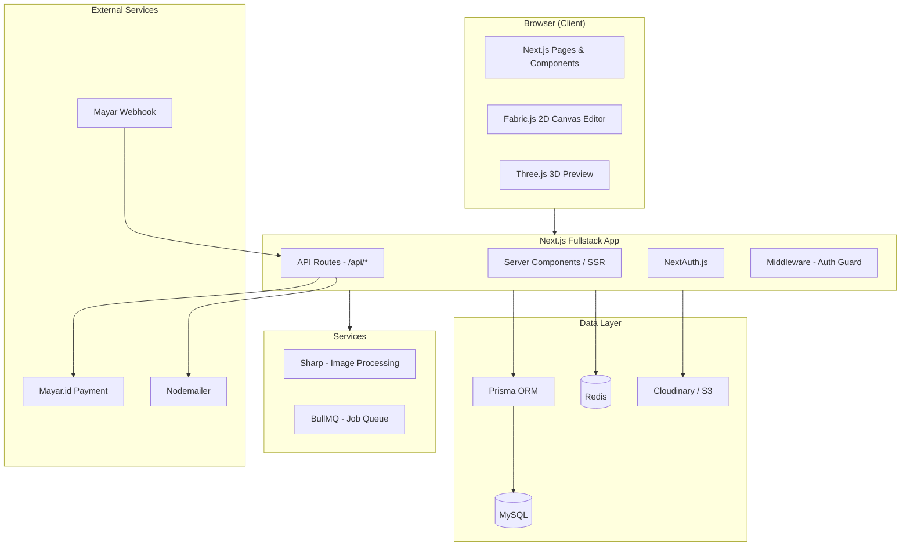
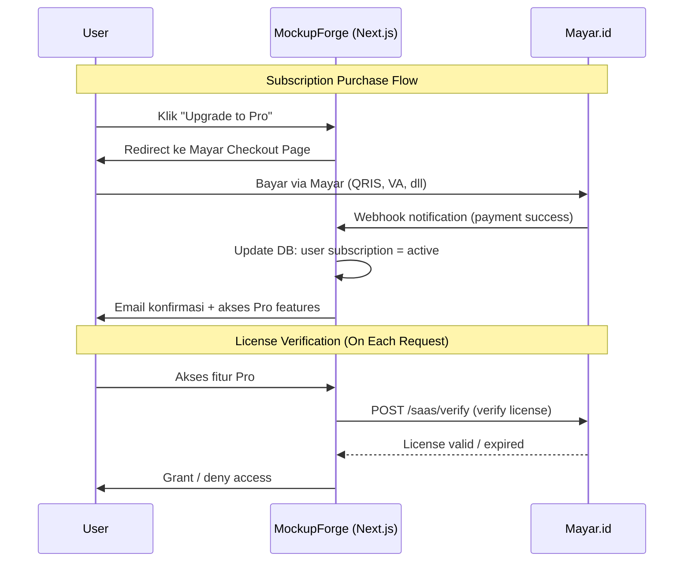

# 🎨 MockupForge — SaaS Mockup Generator

> Platform SaaS untuk mendesain mockup produk (Topi, Gelas, Baju, Hoodie, Totebag, Poster, dll) dengan mudah dan cepat.
> Upload desain → Paskan ke objek 3D → Download hasil mockup profesional.
> **Bilingual**: Bahasa Indonesia + English

> [!NOTE]
> **Referensi Desain**: [Pacdora.com](https://www.pacdora.com) — Clean, minimalist, 3D-centric design dengan sidebar tools, warna putih-ungu, dan real-time 3D preview.

---

## 📋 Ringkasan Project

### Masalah yang Diselesaikan
Desainer, pemilis bisnis kecil, dan content creator sering membutuhkan mockup produk untuk branding, presentasi, atau jualan online. Tools yang ada biasanya mahal, rumit, atau memerlukan software desktop. **MockupForge** hadir sebagai solusi berbasis web yang mudah, cepat, dan terjangkau — khusus untuk pasar Indonesia.

### Target Pengguna (Indonesia)
- **Freelance designer** yang butuh mockup cepat untuk client
- **Pemilik bisnis kecil / UMKM** yang ingin preview produk custom
- **Content creator** yang butuh visual produk untuk sosial media
- **Print-on-demand seller** di Shopee, Tokopedia, dll
- **Mahasiswa desain** yang butuh presentasi tugas

---

## 🏗️ Arsitektur Sistem



---

## 💻 Tech Stack (Updated)

### Frontend + Backend (Fullstack Next.js)
| Teknologi | Kegunaan |
|-----------|----------|
| **Next.js 16** (App Router + Turbopack) | Fullstack framework (SSR + API Routes) |
| **React 19.2** | UI Components |
| **Fabric.js** | Canvas editor 2D (drag, resize, rotate desain) |
| **Three.js** / **React Three Fiber** | 3D preview mockup (rotate objek, lihat dari segala angle) |
| **Vanilla CSS** | Styling dengan design system custom |
| **Framer Motion** | Animasi & transisi premium |
| **Zustand** | Client-side state management |
| **NextAuth.js v5** | Authentication (**Google OAuth**) |
| **next-intl** | Internationalization (ID + EN bilingual) |

### Database & ORM

> [!TIP]
> **Rekomendasi: Prisma ORM** untuk MySQL + Next.js.
>
> Alasan memilih Prisma dibanding Drizzle:
> - **DX (Developer Experience) terbaik** — API yang intuitif, auto-generated TypeScript types
> - **Prisma Studio** — GUI visual untuk browse database tanpa SQL client
> - **Migration system** bawaan (`prisma migrate`) — mudah track perubahan schema
> - **Relasi & nested queries** sangat natural — perfect untuk schema dengan banyak relasi
> - **Dokumentasi** sangat lengkap dan komunitas besar
> - **Battle-tested** dengan MySQL & Next.js di production

| Teknologi | Kegunaan |
|-----------|----------|
| **MySQL 8** | Database utama |
| **Prisma ORM** | Database toolkit, migration, type-safe queries |
| **Redis** | Caching, session store, job queue |

### Image Processing & Storage
| Teknologi | Kegunaan |
|-----------|----------|
| **Sharp** | Server-side image compositing & export |
| **Multer** / **Formidable** | File upload handling |
| **Cloudinary** | Cloud storage untuk gambar (free tier 25GB) |

### Payment & External
| Teknologi | Kegunaan |
|-----------|----------|
| **Mayar.id** | Payment gateway — Membership (SaaS) product type |
| **Mayar Webhook** | Notifikasi otomatis saat payment berhasil |
| **Mayar API** (`api.mayar.id/hl/v1`) | Verify license, activate/deactivate subscription |
| **Nodemailer** | Email notifikasi (welcome, invoice, reminder) |

---

## 🔗 Integrasi Mayar.id — Detail Flow



### Mayar SaaS API Endpoints yang Digunakan:
1. **`POST /saas/verify`** — Verify user subscription license
2. **`POST /saas/activate`** — Activate license setelah payment
3. **`POST /saas/deactivate`** — Deactivate saat cancel/expired
4. **Webhook** — Terima notifikasi payment otomatis

### Setup di Mayar Dashboard:
1. Buat product type "Membership & SaaS"
2. Buat 2 tier: **Pro Monthly** (Rp 49.000) & **Pro Yearly** (Rp 399.000)
3. Set webhook URL ke `https://mockupforge.com/api/webhooks/mayar`
4. Dapatkan API Key dari dashboard Mayar

---

## 💰 Pricing Model & Subscription

### Tier Structure

| Fitur | 🆓 Free | 💎 Pro Monthly | 👑 Pro Yearly |
|-------|---------|----------------|---------------|
| **Harga** | Rp 0 | Rp 49.000/bulan | Rp 399.000/tahun (~Rp 33.250/bln) |
| **Limit Mockup** | 3x total (semua jenis) | ♾️ Unlimited | ♾️ Unlimited |
| **Jenis Produk** | Topi, Gelas, Baju (basic) | Semua jenis + Hoodie, Totebag, Poster, Jersey, dll | Semua jenis |
| **Resolusi Export** | 720p + Watermark | Full HD 1080p, No Watermark | Full HD 1080p, No Watermark |
| **Format Export** | PNG saja | PNG, JPG, WebP, PDF | PNG, JPG, WebP, PDF |
| **3D Preview** | ✅ (basic rotate) | ✅ Full 3D + multiple angles | ✅ Full 3D + multiple angles |
| **Template Mockup** | 5 template dasar | 50+ premium template | 50+ premium template |
| **Background** | 3 warna standar | Unlimited + Custom + Gradient | Unlimited + Custom + Gradient |
| **Save Project** | ❌ | ☁️ 50 project | ☁️ 200 project |
| **Batch Export** | ❌ | ✅ (max 10) | ✅ (max 25) |
| **Priority Render** | ❌ | ✅ | ✅ |
| **Support** | Community | Email | Email + Priority |

---

## ⭐ Fitur Premium untuk Subscriber

### 1. 🎨 Template Library Premium
- **50+ template** mockup berbagai angle, pencahayaan, dan gaya
- Template **seasonal** (Ramadan, Natal, Tahun Baru, 17 Agustus)
- Template **kategori bisnis** (F&B, Fashion, Corporate, Streetwear)
- **Part-based design** — Desain per bagian objek (depan baju, belakang, lengan) seperti Pacdora

### 2. 🔄 Smart Mockup
- **Auto-fit design**: Desain menyesuaikan kontur 3D (lipatan baju, lengkungan gelas)
- **AI Background Removal**: Hapus background desain yang diupload
- **Color matching**: Saran warna objek yang cocok dengan desain

### 3. 📁 Project Management
- **Save & Re-edit**: Simpan dan edit kembali kapan saja
- **Project Folders**: Organisasi per client / kategori
- **Version History**: Restore versi sebelumnya
- **Duplicate Project**: Variasi desain cepat

### 4. 📦 Batch Processing
- Upload multiple desain + generate batch mockup
- 1 desain → beberapa produk sekaligus
- Download semua dalam ZIP

### 5. 🎭 Advanced Customization
- **Custom color picker** — warna produk bebas
- **Custom background** — upload sendiri / gradient / pattern
- **Shadow & Reflection** — efek realistis
- **Text Overlay** — tambah teks dengan font custom
- **Material selection** — Cotton, Polyester, Ceramic, Glass (seperti Pacdora)

### 6. 🔗 Sharing & Collaboration
- **Share Link** — preview mockup untuk client
- **Brand Kit** — simpan palet warna, logo, font brand
- **Direct download link** — untuk client tanpa login

### 7. 📊 Dashboard Analytics
- Statistik mockup yang dibuat (per hari/minggu/bulan)
- Produk paling sering di-mockup
- Download history
- Storage usage meter

### 8. 🎯 Additional Pro Features
- **Multi-angle export** — Export dari beberapa angle sekaligus
- **No watermark** — Hasil bersih profesional
- **Priority rendering queue** — Hasil lebih cepat
- **Early access** — Akses template & fitur baru lebih dulu

---

## 🗄️ Database Schema (Prisma + MySQL)

```prisma
// schema.prisma

datasource db {
  provider = "mysql"
  url      = env("DATABASE_URL")
}

generator client {
  provider = "prisma-client-js"
}

model User {
  id            String    @id @default(uuid())
  name          String
  email         String    @unique
  emailVerified DateTime?
  passwordHash  String?
  image         String?
  role          Role      @default(USER)
  
  // Relations
  accounts      Account[]
  sessions      Session[]
  subscription  Subscription?
  projects      Project[]
  mockupUsages  MockupUsage[]
  
  createdAt     DateTime  @default(now())
  updatedAt     DateTime  @updatedAt
}

model Account {
  id                String  @id @default(uuid())
  userId            String
  type              String
  provider          String
  providerAccountId String
  refreshToken      String? @db.Text
  accessToken       String? @db.Text
  expiresAt         Int?
  tokenType         String?
  scope             String?
  idToken           String? @db.Text
  
  user User @relation(fields: [userId], references: [id], onDelete: Cascade)
  
  @@unique([provider, providerAccountId])
}

model Session {
  id           String   @id @default(uuid())
  sessionToken String   @unique
  userId       String
  expires      DateTime
  
  user User @relation(fields: [userId], references: [id], onDelete: Cascade)
}

model Subscription {
  id              String             @id @default(uuid())
  userId          String             @unique
  plan            SubscriptionPlan   @default(FREE)
  status          SubscriptionStatus @default(ACTIVE)
  mayarLicenseKey String?
  mayarCustomerId String?
  startDate       DateTime           @default(now())
  endDate         DateTime?
  
  user     User      @relation(fields: [userId], references: [id], onDelete: Cascade)
  payments Payment[]
  
  createdAt DateTime @default(now())
  updatedAt DateTime @updatedAt
}

model Payment {
  id                    String        @id @default(uuid())
  subscriptionId        String
  amount                Decimal       @db.Decimal(12, 2)
  currency              String        @default("IDR")
  status                PaymentStatus @default(PENDING)
  mayarTransactionId    String?
  mayarOrderId          String?
  
  subscription Subscription @relation(fields: [subscriptionId], references: [id])
  
  paidAt    DateTime?
  createdAt DateTime  @default(now())
}

model MockupTemplate {
  id              String          @id @default(uuid())
  name            String
  slug            String          @unique
  category        ProductCategory
  description     String?         @db.Text
  thumbnailUrl    String
  templateFileUrl String          // Image or 3D model URL
  modelFileUrl    String?         // .glb/.gltf 3D model
  designArea      Json            // { x, y, width, height, rotation, parts[] }
  isPremium       Boolean         @default(false)
  sortOrder       Int             @default(0)
  
  projects Project[]
  
  createdAt DateTime @default(now())
  updatedAt DateTime @updatedAt
}

model Project {
  id              String        @id @default(uuid())
  userId          String
  templateId      String
  name            String        @default("Untitled Project")
  designImageUrl  String?       // Uploaded design
  designConfig    Json?         // { position, scale, rotation, color, background }
  resultImageUrl  String?       // Generated mockup result
  status          ProjectStatus @default(DRAFT)
  
  user     User            @relation(fields: [userId], references: [id], onDelete: Cascade)
  template MockupTemplate  @relation(fields: [templateId], references: [id])
  usage    MockupUsage?
  
  createdAt DateTime @default(now())
  updatedAt DateTime @updatedAt
}

model MockupUsage {
  id          String          @id @default(uuid())
  userId      String
  projectId   String          @unique
  productType ProductCategory
  
  user    User    @relation(fields: [userId], references: [id], onDelete: Cascade)
  project Project @relation(fields: [projectId], references: [id], onDelete: Cascade)
  
  createdAt DateTime @default(now())
}

enum Role {
  USER
  ADMIN
}

enum SubscriptionPlan {
  FREE
  PRO_MONTHLY
  PRO_YEARLY
}

enum SubscriptionStatus {
  ACTIVE
  EXPIRED
  CANCELLED
}

enum PaymentStatus {
  PENDING
  SUCCESS
  FAILED
  REFUNDED
}

enum ProductCategory {
  TSHIRT
  POLO
  HOODIE
  JERSEY
  HAT
  SNAPBACK
  MUG
  TUMBLER
  TOTEBAG
  POSTER
  PHONE_CASE
}

enum ProjectStatus {
  DRAFT
  COMPLETED
}
```

---

## 📄 Halaman Website (Inspired by Pacdora)

### 1. **Landing Page** (`/`)
- Hero section dengan 3D mockup animasi interaktif (rotating product)
- "How it works" — 3 langkah sederhana
- Category grid (seperti Pacdora)
- Live demo / interactive preview
- Pricing cards section
- Testimonials
- CTA: "Mulai Buat Mockup Gratis"

### 2. **Template Gallery** (`/templates`)
- Sidebar filter kategori: T-Shirt, Polo, Hoodie, Jersey, Hat, Snapback, Mug, Tumbler, Totebag, Poster, Phone Case
- Grid mockup cards dengan 3D badge, color variants preview
- Sort: Popular, Newest, Category
- Badge Free / Premium pada template
- Hover: Quick preview animation

### 3. **Mockup Editor** (`/editor/[templateId]`)
> Halaman utama — mirip Pacdora editor
- **3D Viewport (center)**: Real-time 3D preview yang bisa di-rotate, zoom
- **Sidebar kiri**: Tools (Upload, Models, Layout, Material)
- **Panel kanan**: Design controls (position, scale, rotation)
- **Upload area**: Drag & drop desain
- **Part selector**: Pilih bagian objek (depan, belakang, lengan)
- **Color picker**: Ganti warna produk
- **Material selector**: Cotton, Polyester, Ceramic, dll
- **Background options**: Solid, Gradient, Custom
- **Export panel**: Preview & Download (pilih format & resolusi)

### 4. **Pricing Page** (`/pricing`)
- 3 pricing cards (Free, Pro Monthly, Pro Yearly)
- Feature comparison table
- FAQ accordion
- CTA: "Upgrade Sekarang" → redirect ke Mayar checkout

### 5. **Auth Pages** (`/login`, `/register`)
- Login: Google OAuth (utama)
- Register otomatis saat pertama kali login Google
- Desain modern dengan split-screen (form + mockup visual)
- Language switcher (ID / EN)

### 6. **Dashboard** (`/dashboard`)
- Welcome banner + subscription status
- Usage stats (sisa limit free / unlimited badge)
- Recent projects grid
- Quick start: "Buat Mockup Baru" → pilih kategori
- Storage usage (Pro)

### 7. **My Projects** (`/dashboard/projects`)
- Grid/list view project tersimpan
- Search + filter (kategori, tanggal)
- Actions: Edit, Duplicate, Delete, Download
- Folder organization (Pro)

### 8. **Account Settings** (`/dashboard/settings`)
- Profile edit (name, email, avatar)
- Subscription management (current plan, upgrade/cancel)
- Payment history
- Change password

### 9. **Admin Panel** (`/admin`)
- Manage templates (CRUD)
- User management
- Subscription & payment overview
- Analytics

---

## 📁 Project Structure (Next.js App Router)

```
mockupforge/
├── public/
│   ├── models/          # 3D model files (.glb)
│   ├── templates/       # Mockup template images
│   └── icons/           # SVG icons
├── prisma/
│   ├── schema.prisma    # Database schema
│   ├── seed.ts          # Seed data (templates, admin user)
│   └── migrations/      # Auto-generated migrations
├── src/
│   ├── app/
│   │   ├── [locale]/            # i18n locale routing
│   │   │   ├── layout.tsx       # Root layout per locale
│   │   │   ├── page.tsx         # Landing page
│   │   ├── globals.css          # Global styles + design system
│   │   │   ├── (auth)/
│   │   │   │   └── login/page.tsx
│   │   │   ├── (main)/
│   │   │   ├── templates/page.tsx
│   │   │   ├── pricing/page.tsx
│   │   │   │   └── editor/[templateId]/page.tsx
│   │   │   ├── dashboard/
│   │   │   ├── page.tsx
│   │   │   ├── projects/page.tsx
│   │   │   │   └── settings/page.tsx
│   │   │   └── admin/
│   │   │   ├── page.tsx
│   │   │       ├── templates/page.tsx
│   │   │       └── users/page.tsx
│   │   └── api/
│   │       ├── auth/[...nextauth]/route.ts
│   │       ├── mockup/
│   │       │   ├── generate/route.ts
│   │       │   └── upload/route.ts
│   │       ├── projects/
│   │       │   └── route.ts
│   │       ├── templates/
│   │       │   └── route.ts
│   │       ├── subscription/
│   │       │   └── route.ts
│   │       └── webhooks/
│   │           └── mayar/route.ts
│   ├── components/
│   │   ├── ui/              # Reusable UI (Button, Card, Modal, etc)
│   │   ├── layout/          # Header, Footer, Sidebar
│   │   ├── landing/         # Landing page sections
│   │   ├── editor/          # Editor components (Canvas, Tools, etc)
│   │   ├── dashboard/       # Dashboard widgets
│   │   └── three/           # 3D viewer components (R3F)
│   ├── lib/
│   │   ├── prisma.ts        # Prisma client singleton
│   │   ├── auth.ts          # NextAuth config
│   │   ├── mayar.ts         # Mayar API helper
│   │   ├── cloudinary.ts    # Cloudinary upload helper
│   │   ├── i18n.ts          # Internationalization config
│   │   ├── sharp.ts         # Image processing
│   │   └── utils.ts         # General utilities
│   ├── hooks/               # Custom React hooks
│   ├── store/               # Zustand stores
│   ├── messages/            # i18n translation files (id.json, en.json)
│   └── types/               # TypeScript type definitions
├── .env.local               # Environment variables
├── next.config.ts
├── tsconfig.json
├── package.json
└── README.md
```

---

## 🚀 Rencana Pengembangan — Hari Ini

> [!IMPORTANT]
> Mengingat timeline hari ini, saya akan fokus membangun **MVP yang fungsional dan visually stunning** dengan prioritas sebagai berikut:

### Phase 1 — Foundation (Priority 1) ⏱️
- [ ] Setup Next.js 15 project dengan App Router + TypeScript
- [ ] Setup Prisma + MySQL + seed data
- [ ] Design system (CSS variables, fonts, colors, animations)
- [ ] Landing page premium (terinspirasi Pacdora — clean, 3D hero, category grid)
- [ ] Template gallery page dengan filter kategori

### Phase 2 — Core Features (Priority 2) ⏱️
- [ ] Authentication (NextAuth.js — credentials + Google)
- [ ] Mockup editor 2D dengan Fabric.js (upload, drag, resize, rotate)
- [ ] 3D preview dengan Three.js / React Three Fiber
- [ ] Image export (PNG dengan watermark untuk Free)
- [ ] Free tier tracking (3x limit)
- [ ] Dashboard user

### Phase 3 — Monetization (Priority 3) ⏱️
- [ ] Pricing page
- [ ] Mayar.id integration (Membership SaaS)
- [ ] Webhook handler untuk payment notification
- [ ] License verification middleware
- [ ] Pro features unlock (no watermark, hi-res, save project)

### Phase 4 — Polish & Pro Features ⏱️
- [ ] Batch export
- [ ] Project save & re-edit
- [ ] Admin panel
- [ ] Email notifications
- [ ] Performance optimization

---

## ✅ Keputusan yang Sudah Final

| Keputusan | Jawaban |
|-----------|---------|
| Nama Brand | **MockupForge** |
| Framework | **Next.js 15** (Fullstack) |
| Database | **MySQL 8** + **Prisma ORM** |
| Payment | **Mayar.id** (Membership SaaS) |
| Harga Bulanan | **Rp 49.000/bulan** |
| Harga Tahunan | **Rp 399.000/tahun** |
| Target Market | **Indonesia** |
| Jenis Produk | T-Shirt, Polo, Hoodie, Jersey, Hat, Snapback, Mug, Tumbler, Totebag, Poster, Phone Case |
| 3D Preview | **Ya** — React Three Fiber |
| Referensi Desain | **Pacdora.com** |
| Template Assets | **Perlu di-generate** (gambar + 3D model) |

## Open Questions

> [!WARNING]
> Masih ada pertanyaan yang perlu dijawab sebelum mulai coding:
>
> 1. **Google OAuth**: Apakah ingin login dengan Google, atau email/password saja cukup untuk MVP?
> 2. **Bahasa Website**: Full Bahasa Indonesia atau bilingual (ID + EN)?
> 3. **3D Models**: Untuk MVP hari ini, saya akan fokus ke **2D mockup editor** dulu dengan placeholder 3D preview — apakah oke? (3D model membutuhkan aset .glb yang perlu dibuat/dibeli, butuh waktu lebih)
> 4. **Template Gambar**: Saya akan generate gambar template menggunakan AI untuk MVP. Apakah ada preferensi gaya/style?

---

## Verification Plan

### Automated
- TypeScript type checking (`tsc --noEmit`)
- Prisma schema validation (`prisma validate`)
- Build check (`next build`)

### Manual / Browser Testing
- Test responsive design (mobile, tablet, desktop)
- Test auth flow (register → login → dashboard)
- Test editor flow (pilih template → upload desain → preview → export)
- Test free tier limit (3x mockup → show upgrade prompt)
- Test Mayar payment (sandbox mode)
- Lighthouse performance audit (target > 90)
